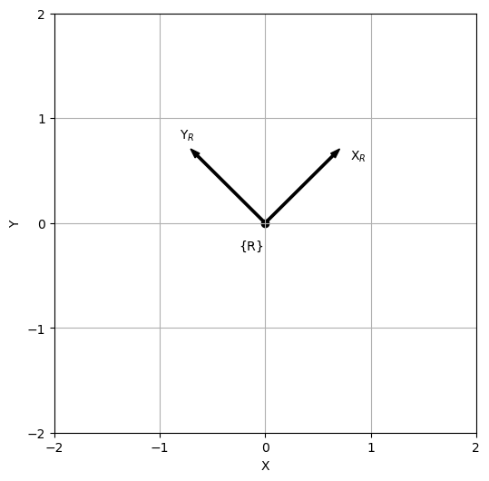

# **Introduction**

Plotting 2D and 3D coordinate systems can be time-consuming and difficult. As such, I created this repository to help make things a bit easier.

# **Installation**

To install this package, type the following commands into the terminal and press <kbd>Enter</kbd> after each one:

```console
git clone https://github.com/drfknoble/plot_frames.git
python -m pip install plot_frames/dist/plot_frames-0.0.1-py3-none-any.whl
```

Afterwards, the library will be installed.

Alternatively, you can download the wheel from the Releases page.

# **Getting Started**

The following code:
* Imports the `numpy` library as `np` for convenience,
* Imports the `plot_frames` library,
* Imports the `pyplot` module from the `matplotlib` library as `plt` for convenience, and
* Imports all of the modules from the `spatialmath` library.

```python
import numpy as np
import plot_frames

from matplotlib import pyplot as plt
from spatialmath import *
```


# **Plotting 2D Systems**

The following code:
* Creates a new figure,
* Configures the figure's axes,
* Creates a 2D system, and
* Draws the 2D pose.

```python
new_plot2d()

T = SE2([0,0], unit='deg')
print(T)

plot_pose2d(T, frame='T')
```  
Afterwards, something similar to the following will be displayed:

  
*Figure*: Plot of a 2D pose.


# **Plotting 3D Systems**

The following code:
* Creates a new figure,
* Configures the figure's axes,
* Creates a 3D system, and
* Draws the 3D pose.

```python
new_plot3d()

T = SE3()
print(T)

plot_pose3d(T, frame='T')
```
Afterwards, something similar to the following will be displayed:

  
*Figure*: Plot of a 3D pose.

# **References**

1. [https://matplotlib.org/stable/index.html](https://matplotlib.org/stable/index.html).
2. [https://numpy.org/doc/1.24/](https://numpy.org/doc/1.24/).
3. [https://petercorke.github.io/spatialmath-python/index.html](https://petercorke.github.io/spatialmath-python/index.html).


# **Credit**

Dr Frazer K. Noble  
Department of Mechanical and Electrical Engineering  
Massey University    
Auckland  
New Zealand    
L: https://www.linkedin.com/in/drfknoble/  
G: https://github.com/drfknoble  
