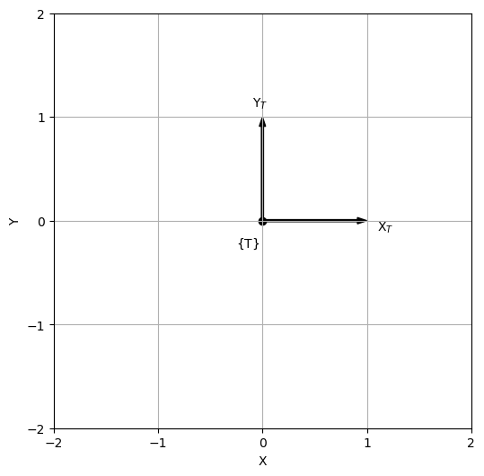
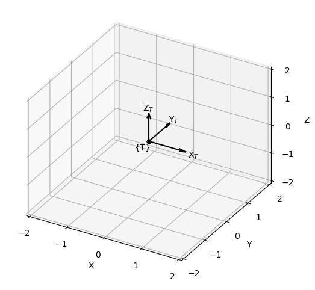

# **Introduction**

Plotting 2D and 3D coordinate systems can be time-consuming and difficult. As such, I created this repository to help make things a bit easier.

# **Installation**

To install this package, download the wheel from this repository's Releases page.

# **Getting Started**

The following code:
* Imports the `numpy` library as `np` for convenience,
* Imports the `plot_frames` library,
* Imports the `pyplot` module from the `matplotlib` library as `plt` for convenience, and
* Imports all of the modules from the `spatialmath` library.

```python
import numpy as np

from plot_frames import *
from spatialmath import *
```


# **Plotting 2D Systems**

The following code:
* Creates a new figure,
* Creates a 2D pose, and
* Plots the 2D pose.

```python
new_plot2d()

T = SE2()
print(T)

plot_pose2d(T, frame='T')
```  
Afterwards, something similar to the following will be displayed:

  
*Figure*: Plot of a 2D pose.


# **Plotting 3D Systems**

The following code:
* Creates a new figure,
* Creates a 3D pose, and
* Draws the 3D pose.

```python
new_plot3d()

T = SE3()
print(T)

plot_pose3d(T, frame='T')
```
Afterwards, something similar to the following will be displayed:

  
*Figure*: Plot of a 3D pose.

# **References**

1. [https://petercorke.github.io/spatialmath-python/index.html](https://petercorke.github.io/spatialmath-python/index.html).


# **Credit**

Dr Frazer K. Noble    
L: https://www.linkedin.com/in/drfknoble/  
G: https://github.com/drfknoble  
